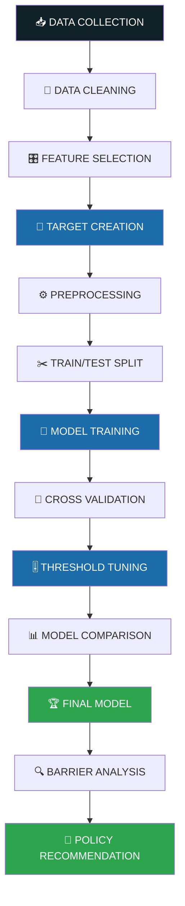
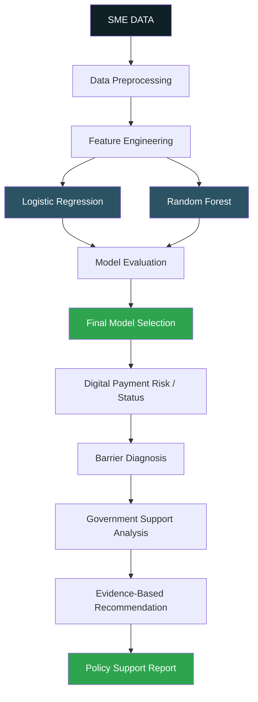
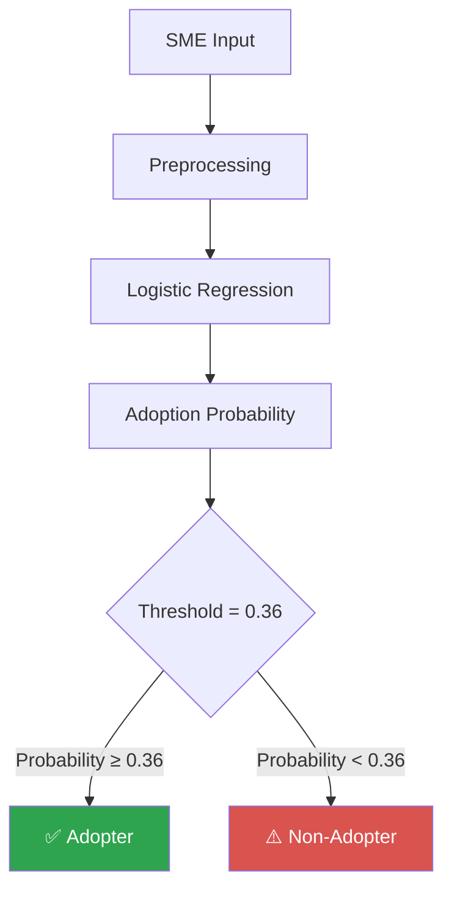
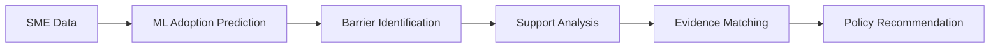

<div align="center">


<br/>


**An academic + engineering project that predicts digital-payment adoption among SMEs, diagnoses adoption barriers, and supports evidence-based policy recommendations.**

[Overview](#-project-overview) •
[Dataset](#-dataset) •
[Methodology](#-ml-methodology) •
[Results](#-model-comparison) •
[Barrier Analysis](#-policy--barrier-analysis) •
[Run](#-installation--running-the-project) •
[Limitations](#-limitations)

</div>

---

## ✅ Implementation Status at a Glance

> Evaluators: the items below have **actually been performed** in this project.

| Stage | Status |
|---|---|
| Data preparation & target creation (`Digital_Payment_Adoption`) | ✅ Done |
| Preprocessing inside sklearn pipelines | ✅ Done |
| **2 models trained** — Logistic Regression, Random Forest | ✅ Done |
| 80/20 stratified train/test split (`random_state = 42`) | ✅ Done |
| 5-fold Stratified Cross-Validation | ✅ Done |
| Threshold tuning on **training out-of-fold predictions** | ✅ Done |
| Model comparison on held-out test set (frozen thresholds) | ✅ Done |
| Final model selected: **Logistic Regression, threshold = 0.36** | ✅ Done |
| Barrier analysis & government-support analysis | ✅ Done (observational) |
| Web interface, automated policy engine, evidence database | 🛠️ Planned / Future Work |

---

## 📌 Project Overview

This project is an **AI-based platform for analyzing FinTech / digital-payment adoption among Small and Medium Enterprises (SMEs)**.

Many SMEs face barriers to adopting digital financial technology:

- 🔹 Lack of information
- 🔹 Uncertainty of demand
- 🔹 Cost / economic-benefit concerns
- 🔹 Lack of technical skills
- 🔹 Difficulty obtaining financing

The platform uses **SME survey data and machine learning** to identify digital-payment adoption patterns and help identify SMEs that **may require attention or support**. It also performs **barrier analysis** and supports **evidence-based policy recommendation**.

> ⚠️ **Scope note:** This system provides **data-driven policy recommendations / policy support**. It does **not** automatically create government policies. Any recommendation should be reviewed by domain and policy experts.

> 🎯 **Prediction scope:** The ML component predicts **digital payment adoption specifically**, not every possible form of FinTech adoption.

---

## ❗ Problem Statement

Large organizations often have dedicated financial and technology teams. SMEs typically have limited resources, financial knowledge, technology awareness, and access to support, which can make adopting digital financial technologies difficult.

This project aims to build a platform that can:

1. Analyze SME characteristics.
2. Predict digital-payment adoption.
3. Identify adoption barriers.
4. Analyze government-support awareness and benefits.
5. Identify SME groups that may need targeted support.
6. Provide evidence-based policy / support recommendations.

---

## 💡 Solution


> The ML prediction, barrier analysis, and government-support analysis are implemented in the notebook. Automated evidence matching and an automated recommendation engine are **Future Work**.

---

## ✨ Key Features

| Feature | Status |
|---|---|
| Digital-payment adoption prediction (binary classification) | ✅ Implemented |
| Two-model comparison (Logistic Regression vs Random Forest) | ✅ Implemented |
| Leakage-aware sklearn preprocessing pipelines | ✅ Implemented |
| 5-fold stratified cross-validation | ✅ Implemented |
| Threshold tuning with training OOF predictions | ✅ Implemented |
| Minority-class (non-adopter) metrics reported openly | ✅ Implemented |
| Barrier analysis with controlled odds ratios | ✅ Implemented |
| Government-support analysis (d7a, d7b, d7c) | ✅ Implemented |
| Saved final model and threshold | ✅ Implemented |
| Web-based SME prediction interface | 🛠️ Planned |
| Automated policy recommendation engine | 🛠️ Planned |
| Explainable AI dashboard | 🛠️ Planned |

---

## 📚 Base Paper

<table>
<tr><td><b>Title</b></td><td><i>Fintech and Entrepreneurship: An Assessment Model to Evaluate Policy Instruments for Fintech Adoption by Small and Medium Enterprises (SMEs)</i></td></tr>
<tr><td><b>Authors</b></td><td>D. Alassaf, T. Daim, M. Dabić, and S. Alzahrani</td></tr>
<tr><td><b>Journal</b></td><td>IEEE Transactions on Engineering Management</td></tr>
<tr><td><b>Year</b></td><td>2024</td></tr>
<tr><td><b>DOI</b></td><td><a href="https://doi.org/10.1109/TEM.2024.3435919">10.1109/TEM.2024.3435919</a></td></tr>
</table>

The base paper **evaluates policy instruments for FinTech adoption among SMEs**. This project **extends the idea into a practical AI/software workflow** using SME data, machine learning, adoption analysis, barrier analysis, and evidence-backed recommendation logic.

> This project is an **extension / implementation inspired by the base paper**. It is **not a reproduction** of the paper.

---

## 🗂️ Dataset

**World Bank Firm Adoption of Technology (FAT) Survey — India, 2021–2023**

| Property | Value |
|---|---|
| Establishments in original working dataset | **1,519** |
| Firms with valid target values (ML dataset) | **1,515** |
| Input features | **13** |
| Target | `Digital_Payment_Adoption` |
| Official source | [microdata.worldbank.org/catalog/8230](https://microdata.worldbank.org/catalog/8230) |

> ⚠️ **Dataset scope:** The FAT India survey covers **formal firms with 5+ employees in covered Indian states**. This project does **not** claim the data represents every SME in India.

> 🔒 **Data policy:** Restricted / raw microdata is **not included** in this repository. Please obtain the dataset from the official World Bank source (see [Installation](#-installation--running-the-project)).

### 🎯 Target Variable — `Digital_Payment_Adoption`

| Value | Meaning |
|---|---|
| `1` | Digital payment **adopter** |
| `0` | Digital payment **non-adopter** |

The target is derived from survey variables **`b14a4`**, **`b14a5`**, and **`b14a6`**.

### ⚖️ Class Distribution

| Class | Count |
|---|---|
| Adopters (1) | **1,354** |
| Non-adopters (0) | **161** |
| **Total valid records** | **1,515** |

The dataset is **imbalanced**. A model that mostly predicts "adopter" can reach high accuracy while missing most non-adopters, so **accuracy alone is not sufficient**. This is why Macro-F1, ROC-AUC, PR-AUC, and class-0 precision/recall are reported alongside accuracy.

---

## 🧬 ML Methodology

### 🔢 Input Features (13)

| Type | Features |
|---|---|
| **Numerical (3)** | `s7`, `a6`, `d3c` |
| **Categorical (10)** | `a5a`, `b5a`, `b5f`, `b5g`, `b5h`, `b13b4`, `b13b5`, `d3a`, `d7a`, `d7b` |

### 🧹 Preprocessing

| Feature type | Steps |
|---|---|
| Numerical | Median imputation → `StandardScaler` |
| Categorical | Most-frequent imputation → `OneHotEncoder(handle_unknown="ignore")` |

Preprocessing is **integrated into sklearn pipelines** to reduce data leakage.

### ✂️ Train / Test Split

| Setting | Value |
|---|---|
| Split | 80% train / 20% test |
| Strategy | **Stratified** |
| `random_state` | 42 |
| Training records | **1,212** |
| Testing records | **303** |

Stratification was used because the target is imbalanced; it preserves the approximate class distribution in both sets.

### 🔁 Cross-Validation

**5-fold Stratified Cross-Validation** was performed to check whether model performance was reasonably stable across different training/validation splits.

> The final test set remains **separate from threshold tuning**.

### 🎚️ Threshold Tuning

The default 0.50 threshold was **not** directly used for the final models. Thresholds were tuned using **out-of-fold (OOF) predictions from the TRAINING data only**, because the target is imbalanced and the project cares about identifying the minority non-adopter class.

| Model | Final Threshold |
|---|---|
| Logistic Regression | **0.36** |
| Random Forest | **0.44** |

> The threshold was **not** selected using the test set.

### 🤖 Models Trained

Exactly **two** main classification models were trained.

<details>
<summary><b>Model 1 — Logistic Regression</b> (click to expand)</summary>

```python
LogisticRegression(
    class_weight="balanced",
    max_iter=2000,
    random_state=42
)
```

**Why:**
- Binary classification problem.
- Easy to interpret.
- Suitable for probability-based prediction.
- Useful for a policy-support project because model relationships can be interpreted.

</details>

<details>
<summary><b>Model 2 — Random Forest</b> (click to expand)</summary>

```python
RandomForestClassifier(
    n_estimators=300,
    class_weight="balanced",
    random_state=42,
    n_jobs=-1
)
```

**Why:**
- Provides a nonlinear comparison model.
- Can capture complex relationships and feature interactions.
- Useful as a benchmark against Logistic Regression.

</details>

### 🔄 Project Workflow



---

## 🏗️ Model Architecture



> The stages up to **Government Support Analysis** are implemented in the analysis workflow. The **Evidence-Based Recommendation** and **Policy Support Report** stages represent the intended end-to-end design; automating them is **Future Work**.

---

## 📊 Model Comparison

All values are from the **held-out test set (303 records)** using **frozen thresholds** tuned on training OOF predictions.

| Metric | Logistic Regression | Random Forest |
|---|:---:|:---:|
| **Threshold** | **0.36** | **0.44** |
| Accuracy | 84.16% | **88.78%** |
| Precision (class 1) | **94.78%** | 92.47% |
| Recall (class 1) | 87.08% | **95.20%** |
| F1-score (class 1) | 90.77% | **93.82%** |
| **Macro-F1** | **67.48%** | 66.55% |
| **ROC-AUC** | **86.37%** | 85.22% |
| PR-AUC | **98.21%** | 98.02% |
| **Class 0 Precision** (non-adopters) | 35.19% | **45.83%** |
| **Class 0 Recall** (non-adopters) | **59.38%** | 34.38% |

### 🧮 Confusion Matrices (rows = actual, columns = predicted; order: 0 = non-adopter, 1 = adopter)

<table>
<tr>
<td align="center"><b>Logistic Regression (threshold 0.36)</b></td>
<td align="center"><b>Random Forest (threshold 0.44)</b></td>
</tr>
<tr>
<td>

|  | Pred 0 | Pred 1 |
|---|:---:|:---:|
| **Actual 0** | 19 | 13 |
| **Actual 1** | 35 | 236 |

</td>
<td>

|  | Pred 0 | Pred 1 |
|---|:---:|:---:|
| **Actual 0** | 11 | 21 |
| **Actual 1** | 13 | 258 |

</td>
</tr>
</table>

### 🧠 How to Read These Results

- **Random Forest** achieved **higher overall accuracy** and **higher positive-class (adopter) F1**.
- However, **Logistic Regression was selected as the final project model** because:
  - ✅ It has a **better Macro-F1**.
  - ✅ It has a **higher ROC-AUC**.
  - ✅ It has **better minority-class (non-adopter) recall** (59.38% vs 34.38%).
  - ✅ It is **more interpretable**.
  - ✅ The project focuses on **identifying SMEs that may require policy/support attention**.
- Minority-class metrics are shown openly: both models find non-adopters only imperfectly, which is a direct consequence of having just 161 non-adopters in the data.

> 📷 *Placeholder:* `results/confusion_matrix.png` — confusion-matrix figure (add once exported from the notebook).

---

## 🏆 Final Model

| Item | Value |
|---|---|
| **Selected model** | **Logistic Regression** |
| **Final threshold** | **0.36** |
| Saved model | `models/final_logistic_regression_model.joblib` |
| Saved threshold | `final_model_threshold.json` |



```text
Probability >= 0.36  →  Adopter
Probability <  0.36  →  Non-Adopter
```

---

## 🔍 Policy & Barrier Analysis

Barrier analysis uses the FAT survey. Major barriers observed among **non-adopters** include:

- Uncertainty of demand
- Lack of information
- Cost / economic-benefit concerns
- Lack of technical skills
- Difficulty obtaining financing

### 📐 Controlled Analysis (controlling for firm size, sector, and state)

| Barrier | Odds Ratio (OR) | 95% CI | p-value | Interpretation |
|---|:---:|:---:|:---:|---|
| Lack of information | **2.54** | 1.58–4.08 | < 0.001 | Associated with higher odds of non-adoption |
| Financing barrier | **2.11** | 1.06–4.21 | 0.033 | Associated with higher odds of non-adoption |
| Uncertainty of demand | **1.71** | 1.10–2.66 | 0.018 | Associated with higher odds of non-adoption |
| Technical skills | 1.45 | 0.90–2.34 | 0.131 | Not statistically significant |
| Cost barrier | 1.19 | 0.75–1.89 | 0.455 | Not statistically significant |

> ⚠️ **These are observational associations, NOT causal effects.** For example, lack of information was *associated with higher odds of non-adoption*; this analysis does not show that it *causes* non-adoption.

### 🏛️ Government Support Analysis

The dataset contains these government-support variables:

| Variable | Meaning |
|---|---|
| `d7a` | Awareness of government support/subsidy for technology adoption |
| `d7b` | Whether the firm benefited from government support/subsidy |
| `d7c` | Type of government program/subsidy received |

**Among firms that reported benefiting from government support:**

| Group | Count |
|---|:---:|
| Firms reporting benefit | **436** |
| Adopters | 390 |
| Non-adopters | 46 |

**"Lack of information" among beneficiaries:**

| Group | Reported lack of information |
|---|:---:|
| Adopters | 31.54% |
| Non-adopters | 56.52% |

Fisher's exact test: **Odds Ratio = 2.82, p = 0.0015**

> **Careful interpretation:** Among firms reporting government-support benefits, non-adopters had higher odds of reporting lack of information. This is an **association**. It is **not** evidence that government support caused, or failed to cause, adoption.

---

## 📁 Repository Structure

> Entries marked **(planned)** are not in the repository yet.

```text
SPARK/
│
├── notebooks/
│   └── model_training.ipynb               # training, CV, threshold tuning, evaluation, analysis
│
├── models/
│   └── final_logistic_regression_model.joblib
│
├── results/
│   ├── final_model_results.csv
│   ├── cv_results.csv
│   ├── threshold_results.csv
│   └── confusion_matrix.png
│
├── dataset/                               # (planned) README on how to obtain the official dataset
│   └── README.md
│
├── papers pep project/                    # (planned) research papers / references
│
├── final_model_threshold.json             # saved final threshold (0.36)
├── spark-banner.png                       # README banner
├── requirements.txt
├── .gitignore
│
└── README.md
```

---

## 🛠️ Technologies

| Technology | Purpose |
|---|---|
|  | Core language |
|  | Data handling |
|  | Numerical computing |
|  | Pipelines, models, CV, metrics |
|  | Visualization |
|  | Notebook environment |
|  | Version control |
|  | Hosting |

---

## ⚙️ Installation & Running the Project

**Windows + VS Code**

```bash
# 1. Clone the repository
git clone https://github.com/iamkrishna27/SPARK.git
cd SPARK

# 2. Create a virtual environment
python -m venv venv

# 3. Activate it (Windows)
venv\Scripts\activate

# 4. Install dependencies
pip install -r requirements.txt

# 5. Launch Jupyter
jupyter notebook
```

Then open **`notebooks/model_training.ipynb`** and **run the notebook from top to bottom**.

### 📥 Obtaining the Dataset

The dataset is **not included** in this repository. To run the notebook:

1. Obtain the **World Bank Firm Adoption of Technology (FAT) Survey — India, 2021–2023** from the official source: <https://microdata.worldbank.org/catalog/8230>
2. Follow the World Bank's access/terms of use.
3. Place the data file(s) according to the **path configuration at the top of the notebook**.

> 🔒 Please do **not** commit restricted/raw microdata to this public repository unless redistribution is explicitly permitted.

---

## 🔬 Research Reproducibility

| Element | Setting |
|---|---|
| Random seed | `random_state = 42` |
| Split | 80/20 **stratified** (1,212 train / 303 test) |
| Cross-validation | 5-fold **stratified** CV |
| Preprocessing | sklearn pipelines (median/standard-scaling for numerical; most-frequent/one-hot for categorical) |
| Threshold tuning | Using **training OOF predictions** only |
| Final evaluation | **Held-out test set**, frozen thresholds |
| Saved final model | `models/final_logistic_regression_model.joblib` |
| Saved threshold | `final_model_threshold.json` |
| Saved evaluation results | `results/` (final results, CV results, threshold results, confusion matrix) |

---

## 🎓 Research Contribution

| | |
|---|---|
| **Base paper** | Evaluates policy instruments for SME FinTech adoption. |
| **This project** | Transforms the research concept into a practical AI-driven workflow. |



This project is an **extension / implementation inspired by the base paper**, **not a reproduction** of it.

---

## ⚠️ Limitations

1. The dataset is limited to the **FAT India survey scope** (formal firms with 5+ employees in covered states).
2. Results should **not** be automatically generalized to every Indian SME.
3. The target represents **digital payment adoption**, not complete FinTech adoption.
4. The dataset is **imbalanced** (1,354 adopters vs 161 non-adopters).
5. Barrier analysis is **observational**.
6. Model predictions **do not prove causality**.
7. Policy recommendations should be **evidence-backed and reviewed by domain/policy experts**.
8. The public GitHub repository **should not contain restricted raw survey microdata**.

---

## 🚀 Future Work

> None of the following is implemented yet.

- [ ] Full web-based SME prediction interface
- [ ] Automated policy recommendation engine
- [ ] Evidence database for interventions
- [ ] Explainable AI dashboard
- [ ] More representative datasets
- [ ] Additional external validation
- [ ] Better survey-aware statistical modeling
- [ ] Monitoring model performance after deployment

---

## 📖 References

1. D. Alassaf, T. Daim, M. Dabić, and S. Alzahrani, "Fintech and Entrepreneurship: An Assessment Model to Evaluate Policy Instruments for Fintech Adoption by Small and Medium Enterprises (SMEs)," *IEEE Transactions on Engineering Management*, 2024. DOI: [10.1109/TEM.2024.3435919](https://doi.org/10.1109/TEM.2024.3435919)
2. World Bank, *Firm Adoption of Technology (FAT) Survey — India, 2021–2023*. <https://microdata.worldbank.org/catalog/8230>

---

## 👤 Author

<div align="center">

**Krishna N.**
B.E. Computer Science, St. Joseph's College of Engineering, Chennai

[](https://github.com/iamkrishna27)

*Repository: [github.com/iamkrishna27/SPARK](https://github.com/iamkrishna27/SPARK)*


</div>
