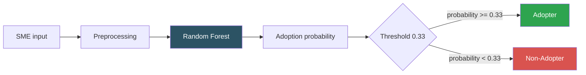
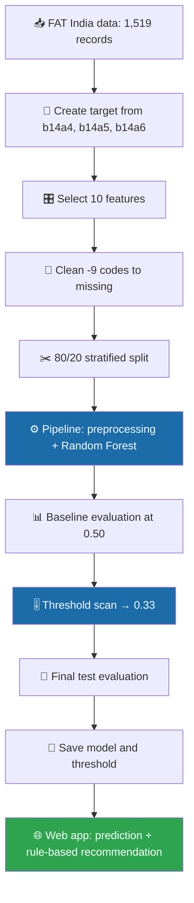
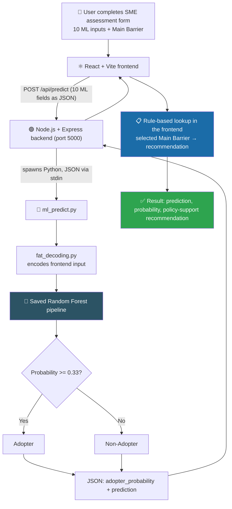

<div align="center">


<br/>


**An AI-based platform that predicts whether an SME is likely to adopt digital payments and returns a rule-based policy-support recommendation for the SME's selected main adoption barrier.**

[Overview](#project-overview) •
[Dataset](#dataset) •
[Methodology](#ml-methodology) •
[Results](#final-model-results) •
[Architecture](#system-architecture) •
[Recommendations](#rule-based-recommendation-module) •
[Run](#installation-and-running) •
[Limitations](#limitations)

</div>

---

## Implementation Status at a Glance

| Component | Status |
|---|---|
| Data preparation and target creation (`Digital_Payment_Adoption`) | ✅ Implemented |
| Final model: Random Forest in an sklearn pipeline (preprocessing inside the pipeline) | ✅ Implemented |
| 80/20 stratified train/test split (`random_state = 42`) | ✅ Implemented |
| Final threshold **0.33** and held-out test evaluation | ✅ Implemented (see [threshold note](#threshold-selection)) |
| 5-fold stratified CV and training out-of-fold threshold search | ✅ Implemented in the earlier comparison notebook · ⚠️ not repeated for the final 10-feature model |
| Survey-based barrier analysis and government-support analysis | ✅ Implemented (observational) |
| **Web application** — React + Vite → Express → Python ML module | ✅ Implemented (local prototype) |
| **Rule-based recommendation module** | ✅ Implemented |
| Explainable-AI dashboard, evidence database, deployment, post-deployment monitoring | 🛠️ Future Work |

---

## Project Overview

SMEs often face barriers to adopting digital financial technology: lack of information, uncertainty about demand, cost / economic-benefit concerns, lack of technical skills, and difficulty obtaining financing.

This project builds a platform that does two separate things:

1. **Predicts digital-payment adoption.** A Random Forest classifier trained on World Bank FAT India survey data outputs an **adoption probability** and an **Adopter / Non-Adopter** label.
2. **Suggests policy support.** A **separate rule-based module** maps the barrier the user selects to a predefined support recommendation.

> **Important:** The Random Forest predicts adoption only. It does **not** generate the recommendation. The recommendation comes from a simple IF–THEN mapping on the selected barrier.

> **Policy wording:** The system provides *policy support* and *policy recommendations* as decision-support suggestions. It does **not** create government policy. Recommendations should be reviewed by policy and domain experts.

> **Prediction scope:** The model predicts **digital payment adoption**, not every form of FinTech adoption.

The project also includes survey-based **barrier analysis** and **government-support analysis** (see [Barrier and Government-Support Analysis](#barrier-and-government-support-analysis)).

---

## Base Paper

<table>
<tr><td><b>Title</b></td><td><i>Fintech and Entrepreneurship: An Assessment Model to Evaluate Policy Instruments for FinTech Adoption by Small and Medium Enterprises (SMEs)</i></td></tr>
<tr><td><b>Authors</b></td><td>D. Alassaf, T. Daim, M. Dabić, and S. Alzahrani</td></tr>
<tr><td><b>Journal</b></td><td>IEEE Transactions on Engineering Management</td></tr>
<tr><td><b>Year</b></td><td>2024</td></tr>
<tr><td><b>DOI</b></td><td><a href="https://doi.org/10.1109/TEM.2024.3435919">10.1109/TEM.2024.3435919</a></td></tr>
</table>

The base paper evaluates policy instruments for FinTech adoption among SMEs. This project is an **extension / implementation inspired by the base paper**, turning the idea into a working software workflow with SME survey data, machine learning, barrier-based recommendations and a web interface. It is **not a reproduction** of the paper.

---

## Dataset

**World Bank Firm Adoption of Technology (FAT) Survey — India, 2021–2023**

| Property | Value |
|---|---|
| Records used | **1,519** |
| Working dataset size | 1,519 rows × 837 columns |
| Features used by the final model | **10** |
| Target | `Digital_Payment_Adoption` |
| Adopters (1) | **1,357** (89.34%) |
| Non-adopters (0) | **162** (10.66%) |
| Official source | [microdata.worldbank.org/catalog/8230](https://microdata.worldbank.org/catalog/8230) |

> **Dataset scope:** The FAT India survey covers **formal firms with 5+ employees in covered Indian states**. This project does **not** claim the data represents every SME in India.

> **Data policy:** Raw survey microdata is **not included** in this repository (the `.gitignore` excludes `*.sav`, `*.xlsx`, `*_working.csv` and `fat_india*.csv`). Obtain the data from the official World Bank source and follow its terms of use.

### Target variable

| Value | Meaning |
|---|---|
| `1` | Digital payment **adopter** |
| `0` | Digital payment **non-adopter** |

The target is derived from the survey variables `b14a4`, `b14a5` and `b14a6`: a firm is labelled an adopter if **any** of the three is "Yes".

### Class imbalance

Adopters outnumber non-adopters roughly 8.4 to 1. Because of this, **accuracy alone is not sufficient**: a model can score well by favouring the adopter class while missing many non-adopters. Class-specific metrics for both classes are reported below.

---

## ML Methodology

### Final features (10)

| # | Feature | Meaning | Treated as |
|---|---|---|---|
| 1 | `s7` | Number of employees | Numerical |
| 2 | `a6` | Year business started | Numerical |
| 3 | `d3c` | Number of times needed to borrow but could not get the loan | Categorical (one-hot) |
| 4 | `a5a` | Sector | Categorical |
| 5 | `b5f_decoded` | Own website | Categorical |
| 6 | `b5g_decoded` | Online social media | Categorical |
| 7 | `d3a` | Loan for machinery / equipment / licensing | Categorical |
| 8 | `d7a` | Awareness of government technology-support program | Categorical |
| 9 | `d7b` | Benefited from government technology-support program | Categorical |
| 10 | `b13b5` | Sales through own website | Categorical |

### Preprocessing (inside the sklearn pipeline)

| Feature type | Steps |
|---|---|
| Numerical | Median imputation **with missing indicators** → `StandardScaler` |
| Categorical | Most-frequent imputation → `OneHotEncoder(handle_unknown="ignore")` |

Preprocessing is part of the same sklearn `Pipeline` as the classifier, so it is fit on training data only.

### Train / test split

| Setting | Value |
|---|---|
| Split | 80% train / 20% test, **stratified** |
| `random_state` | 42 |
| Training records | **1,215** (1,085 adopters / 130 non-adopters) |
| Test records | **304** (272 adopters / 32 non-adopters) |

### Final model

```python
RandomForestClassifier(
    n_estimators=500,
    min_samples_leaf=5,
    class_weight="balanced",
    random_state=42,
    n_jobs=-1
)
```

The model outputs (1) an **Adopter / Non-Adopter** label and (2) an **adoption probability**.



### Threshold selection

The final threshold is **0.33**. In `notebooks/model_training_final.ipynb`, candidate thresholds from 0.30 to 0.60 were scanned using the Random Forest's probabilities on the **held-out test set**; 0.33 tied for the highest accuracy (89.14%) and had the best Non-Adopter F1 among the tied thresholds.

> **Caveat:** Because the threshold was chosen on the same test set that is used for the reported results, the test metrics below are **optimistic**. The training-only out-of-fold threshold search (see next section) was implemented for the earlier comparison experiment but has **not** been repeated for the final model. This is listed under [Limitations](#limitations) and [Future Work](#future-work).

The effect of the threshold on the test set:

| Threshold | Accuracy | Non-Adopter precision | Non-Adopter recall | Non-Adopter F1 | Confusion matrix `[[TN, FP], [FN, TP]]` |
|:---:|:---:|:---:|:---:|:---:|:---:|
| 0.50 (default) | 80.59% | 34.48% | 93.75% | 50.42% | `[[30, 2], [57, 215]]` |
| **0.33 (final)** | **89.14%** | **48.39%** | **46.88%** | **47.62%** | `[[15, 17], [16, 256]]` |

A lower threshold is more accurate overall and more precise on non-adopters, but it flags fewer true non-adopters than the 0.50 default. Which trade-off is preferable depends on how costly missed non-adopters are compared with false alarms.

### Cross-validation

5-fold stratified cross-validation (`StratifiedKFold(n_splits=5, shuffle=True, random_state=42)`) and training-set out-of-fold threshold search are implemented in `notebooks/model_training.ipynb`. That notebook belongs to an **earlier comparison experiment** (Logistic Regression vs Random Forest on a larger feature set) and is kept for reference; its saved outputs are not stored in the committed copy. The final 10-feature Random Forest notebook does **not** include cross-validation.

<details>
<summary><b>Notebook guide</b> (click to expand)</summary>

| Notebook | Purpose |
|---|---|
| `notebooks/01_data_preprocessing.ipynb` | Data preparation, exploratory work, and the barrier / government-support analyses |
| `notebooks/model_training_final.ipynb` | **Final** 10-feature Random Forest: target, split, pipeline, baseline, threshold scan, final evaluation, model saving |
| `notebooks/model_training.ipynb` | Earlier comparison experiment (Logistic Regression vs Random Forest, 5-fold CV, training-OOF threshold search) — kept for reference; does not describe the final model |

`results/final_model_results.csv`, `results/bootstrap_class0_results.csv` and `results/lift_results.csv` come from the earlier comparison experiment, and `models/final_model_threshold.json` is a leftover from it. They do not describe the final Random Forest.

</details>

### Project workflow



---

## Final Model Results

Test set: **304 records** (272 adopters, 32 non-adopters), threshold **0.33**.

| Metric | Value |
|---|:---:|
| **Overall accuracy** | **89.14%** |
| Adopter (class 1) precision | 93.77% |
| Adopter (class 1) recall | 94.12% |
| Adopter (class 1) F1-score | 93.94% |
| **Non-Adopter (class 0) precision** | **48.39%** |
| **Non-Adopter (class 0) recall** | **46.88%** |
| **Non-Adopter (class 0) F1-score** | **47.62%** |

> The 93.77% / 94.12% / 93.94% figures are for the **Adopter class only**. They do not describe the Non-Adopter class, whose precision, recall and F1 are all below 50%.

### Confusion matrix

| | Predicted Non-Adopter | Predicted Adopter |
|---|:---:|:---:|
| **Actual Non-Adopter (32)** | 15 | 17 |
| **Actual Adopter (272)** | 16 | 256 |

The model correctly identifies 15 of 32 non-adopters. Of the 31 firms it labels non-adopters, 15 truly are.

---

## System Architecture



In words: React + Vite frontend → Node.js + Express backend → Python ML prediction module → saved Random Forest → prediction result → rule-based recommendation for the selected barrier → final result.

### Backend (Node.js + Express.js)

| Item | Detail |
|---|---|
| Runtime / framework | Node.js, Express.js, CORS |
| Port | 5000 |
| `GET /api/health` | Returns `{ "success": true, "message": "FinTech backend is running" }` |
| `POST /api/predict` | Spawns the Python script with the configured virtual-environment interpreter, sends the JSON body through stdin, and returns the result |

<details>
<summary><b><code>POST /api/predict</code> request and response</b> (click to expand)</summary>

Request body (the 10 ML input fields; the selected main barrier is **not** sent to the backend):

```json
{
  "employees": "<integer>",
  "year_started": "<year>",
  "sector": "<sector name>",
  "loan_needed_not_received_count": "<integer>",
  "has_website": "Yes | No",
  "uses_social_media": "Yes | No | Don't know",
  "financed_equipment": "Yes | No | Don't know",
  "aware_gov_support": "Yes | No",
  "benefited_gov_support": "Yes | No | Don't know",
  "sells_via_own_website": "Yes | No | Don't know"
}
```

Success response:

```json
{
  "success": true,
  "adopter_probability": "<number between 0 and 1>",
  "prediction": "Adopter | Non-Adopter"
}
```

On failure the backend responds with status 500 and `{ "success": false, "message": "..." }`.

</details>

### Python ML module (`backend/ml_predict.py`, `backend/fat_decoding.py`)

- Loads the saved Random Forest pipeline (`final_random_forest_model.joblib`).
- Uses the threshold **0.33** (set in `ml_predict.py`).
- Encodes the frontend input into the model's feature format using `fat_decoding.py`.
- Predicts and returns the **adoption probability** and the **prediction label**.

### Frontend (React + Vite + JavaScript)

- SME assessment form with the **10 ML input fields** plus a **Main Barrier to FinTech Adoption** selection.
- Result view showing the **prediction**, the **adoption probability**, and the **policy-support recommendation**.
- **Assess Again** button to start a new assessment.

---

## Rule-Based Recommendation Module

The recommendation is implemented in the frontend (`frontend/src/App.jsx`) as a simple **IF–THEN lookup on the barrier the user selects**. It does not use the Random Forest output, and the same lookup applies whether the prediction is Adopter or Non-Adopter.

| Selected main barrier | Recommended support (as implemented) |
|---|---|
| Lack of information | FinTech awareness programs, digital-payment training, and information about available government support |
| Uncertainty about demand | SME digital-market support, customer adoption programs, and pilot initiatives to reduce uncertainty |
| Cost / economic benefit | Financial incentives, reduced transaction-cost support, and affordable FinTech solutions |
| Lack of technical skills | Digital-skills training, technical assistance, and SME FinTech support centers |
| Lack of financing | Improved access to suitable digital-finance products, credit support, and financing assistance |
| Consumer preference | Digital-payment awareness among customers and encouragement of SME digital-payment usage |
| Regulatory issues | Clear FinTech adoption guidelines, simplified procedures, and regulatory support |
| Other | General FinTech advisory and SME digital-transformation support |

> These are predefined **decision-support suggestions**. They have not been validated for real-world policy impact and should be reviewed by policy and domain experts.

---

## Barrier and Government-Support Analysis

The project includes survey-based analysis of adoption barriers and government support (`notebooks/01_data_preprocessing.ipynb`, outputs in `results/`). Major barriers examined include uncertainty of demand, lack of information, cost / economic-benefit concerns, lack of technical skills, and financing difficulties.

> **All findings below are observational associations, not causal effects.**

### Lack of information (controlled model)

Logistic regression of non-adoption on lack of information, controlling for log firm size, sector (`a5a`) and state (`s2e`) — `results/controlled_barrier_logistic_results.csv`:

| Variable | Odds ratio | 95% CI | p-value |
|---|:---:|:---:|:---:|
| Lack of information | 1.75 | 1.15–2.65 | 0.0084 |

Lack of information was **associated with higher odds of non-adoption** in this model.

A multiple-barrier model with Holm correction (`results/multiple_barrier_holm_results.csv`) found no individual barrier statistically significant after adjustment.

### Government support (`d7a`, `d7b`, `d7c`)

| Variable | Meaning |
|---|---|
| `d7a` | Awareness of government support / subsidy for technology adoption |
| `d7b` | Whether the firm benefited from government support / subsidy |
| `d7c` | Type of government program / subsidy received |

**Among firms reporting a government-support benefit** (436 firms: 390 adopters, 46 non-adopters), lack of information was reported by **31.54%** of adopters and **56.52%** of non-adopters (Fisher's exact test: odds ratio 2.82, p = 0.0015).

Among firms reporting government-support benefits, non-adopters had higher odds of reporting lack of information. This is an **association**. It is **not** evidence that government support caused, or failed to cause, adoption.

<details>
<summary><b>Non-adoption by support type</b> (click to expand)</summary>

From `results/government_support_type_adoption_analysis.csv` (chi-square = 19.25, df = 4, p = 0.0007):

| Support type | Adopters | Non-adopters | Non-adoption % |
|---|:---:|:---:|:---:|
| Grant | 11 | 2 | 15.38% |
| Information | 37 | 8 | 17.78% |
| Loan | 143 | 2 | 1.38% |
| Tax incentive | 143 | 24 | 14.37% |
| Technical assistance | 51 | 6 | 10.53% |

</details>

---

## Repository Structure

```text
SPARK/
│
├── backend/
│   ├── server.js                  # Express API: /api/health, /api/predict
│   ├── ml_predict.py              # loads saved model, applies threshold 0.33
│   ├── fat_decoding.py            # encodes frontend input for the model
│   ├── package.json
│   └── README.md
│
├── frontend/
│   ├── index.html
│   ├── package.json
│   ├── vite.config.js
│   ├── public/
│   └── src/
│       ├── App.jsx                # assessment form, result, rule-based recommendations
│       ├── App.css
│       ├── index.css
│       ├── main.jsx
│       └── assets/
│
├── models/
│   ├── final_random_forest_threshold.json   # {"threshold": 0.33}
│   └── final_model_threshold.json           # leftover from the earlier experiment
│   # final_random_forest_model.joblib is generated by the notebook (git-ignored)
│
├── notebooks/
│   ├── 01_data_preprocessing.ipynb
│   ├── model_training_final.ipynb           # final Random Forest
│   └── model_training.ipynb                 # earlier comparison experiment
│
├── results/
│   ├── final_model_results.csv                          # earlier experiment
│   ├── bootstrap_class0_results.csv                     # earlier experiment
│   ├── lift_results.csv                                 # earlier experiment
│   ├── controlled_barrier_logistic_results.csv
│   ├── multiple_barrier_holm_results.csv
│   ├── government_benefit_information_comparison.csv
│   └── government_support_type_adoption_analysis.csv
│
├── requirements.txt
├── spark-banner.png
├── .gitignore
└── README.md
```

---

## Technologies

| Technology | Role |
|---|---|
| React | Frontend UI |
| Vite | Frontend build tool and dev server |
| JavaScript | Frontend and backend code |
| Node.js | Backend runtime |
| Express.js | Backend API (with CORS) |
| Python | ML training and prediction module |
| Pandas | Data handling |
| NumPy | Numerical computing |
| scikit-learn | Pipelines, Random Forest, metrics |
| Jupyter | Notebooks |
| Git / GitHub | Version control and hosting |

`requirements.txt` also lists matplotlib, seaborn, openpyxl, statsmodels (pinned to 0.15.0) and imbalanced-learn.

---

## Installation and Running

**Windows + VS Code.** The trained model file and the raw dataset are **not** in the repository, so run the notebooks first.

### 1. Clone and set up Python

```bash
git clone https://github.com/iamkrishna27/SPARK.git
cd SPARK

python -m venv venv
venv\Scripts\activate
pip install -r requirements.txt
```

### 2. Obtain the dataset

1. Download the **FAT India 2021–2023** microdata from the official source: <https://microdata.worldbank.org/catalog/8230> (follow the World Bank's terms of use).
2. Prepare the working dataset using `notebooks/01_data_preprocessing.ipynb`.
3. Do **not** commit raw or restricted microdata to a public repository.

### 3. Train and save the final model

```bash
jupyter notebook
```

Open `notebooks/model_training_final.ipynb` and run it top to bottom. It saves `final_random_forest_model.joblib` and `final_random_forest_threshold.json`.

> The notebooks currently contain **absolute Windows paths from the author's machine** (for example `DATA_PATH` and `MODEL_DIR`). Update them to your own folders before running.

### 4. Configure and start the backend

In `backend/server.js`, set `PYTHON_PATH` (your virtual environment's `python.exe`) and `ML_SCRIPT_PATH` (path to `backend/ml_predict.py`). In `backend/ml_predict.py`, set `MODEL_PATH` to the saved `.joblib` file. These are currently hard-coded to the author's machine.

```bash
cd backend
npm install
npm start
```

The backend runs at `http://localhost:5000`. Check it at `http://localhost:5000/api/health`.

### 5. Start the frontend

In a second terminal:

```bash
cd frontend
npm install
npm run dev
```

Open the local URL printed by Vite. The frontend calls the backend at `http://localhost:5000/api/predict`.

---

## Research Reproducibility

| Element | Setting |
|---|---|
| Random seed | `random_state = 42` (split and Random Forest) |
| Split | 80/20 stratified (1,215 train / 304 test) |
| Preprocessing | Inside the sklearn pipeline |
| Final model | Random Forest (`n_estimators=500`, `min_samples_leaf=5`, `class_weight="balanced"`) |
| Final threshold | 0.33, saved in `models/final_random_forest_threshold.json` |
| Saved model | `final_random_forest_model.joblib`, **generated by running the notebook** (git-ignored, not in the repository) |
| Saved results | CSV files in `results/` |
| Dependencies | `requirements.txt` (only `statsmodels` is version-pinned) |

---

## Limitations

1. The dataset is limited to the **FAT India survey scope** (formal firms with 5+ employees in covered states) and should not be generalized to every Indian SME.
2. The target represents **digital payment adoption**, not complete FinTech adoption.
3. The data is **imbalanced** (1,357 adopters vs 162 non-adopters). The final model's Non-Adopter precision, recall and F1 are all below 50%, so many non-adopters are missed or mislabeled.
4. The **0.33 threshold was chosen using test-set probabilities**, so the reported test metrics are optimistic. Cross-validation and training-only threshold tuning were not repeated for the final 10-feature model.
5. Barrier and government-support findings are **observational associations**; model predictions do not prove causality.
6. The recommendation module is **rule-based**: it depends on the barrier the user selects, is independent of the model output, and has not been validated for real-world policy impact. Recommendations should be reviewed by policy and domain experts.
7. The web application is a **local prototype**: no deployment configuration is included, file paths are hard-coded for the author's machine, and input-range warnings produced by the Python module are not shown in the interface.
8. The sector dropdown lists 17 survey sectors, but the model's decoder accepts only the 12 that occur in the training data. Selecting Agriculture, Livestock, Bricks, Cement or Iron and Steel currently makes the prediction request fail.
9. Raw survey microdata and the trained model file are not included in the public repository.

---

## Future Work

> None of the following is implemented yet.

- [ ] Repeat 5-fold stratified cross-validation and training out-of-fold threshold selection for the final 10-feature Random Forest
- [ ] Explainable-AI dashboard
- [ ] Evidence database for interventions, linked to recommendations
- [ ] Data-driven recommendation logic (the current module is rule-based)
- [ ] More representative datasets and additional external validation
- [ ] Better survey-aware statistical modeling
- [ ] Configurable paths, deployment, and monitoring of model performance after deployment

---

## References

1. D. Alassaf, T. Daim, M. Dabić, and S. Alzahrani, "Fintech and Entrepreneurship: An Assessment Model to Evaluate Policy Instruments for FinTech Adoption by Small and Medium Enterprises (SMEs)," *IEEE Transactions on Engineering Management*, 2024. DOI: [10.1109/TEM.2024.3435919](https://doi.org/10.1109/TEM.2024.3435919)
2. World Bank, *Firm Adoption of Technology (FAT) Survey — India, 2021–2023*. <https://microdata.worldbank.org/catalog/8230>

---

## Author

<div align="center">

**Krishna N.**
B.E. Computer Science, St. Joseph's College of Engineering, Chennai

[](https://github.com/iamkrishna27)

*Repository: [github.com/iamkrishna27/SPARK](https://github.com/iamkrishna27/SPARK)*

</div>
